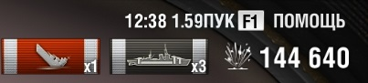

# mxMeter #

I was inspired by the topic on RU forum which explains game economics: https://forum.worldofwarships.ru/topic/68750-%D0%B8%D0%B7%D0%BC%D0%B5%D0%BD%D0%B5%D0%BD%D0%B8%D1%8F-%D1%8D%D0%BA%D0%BE%D0%BD%D0%BE%D0%BC%D0%B8%D0%BA%D0%B8-%D0%B4%D0%BE-%D0%B8-%D0%BF%D0%BE%D1%81%D0%BB%D0%B5-0512/

## The mod looks like this (on the right from the clock):

- In the battle:



- In the battle results:


## What it counts:

- Main caliber damage, secondary, torpedoes and bombs
- One taken down plane is 1/30
- A frag/kill = 1/5
- A cap = 1/3
- Scouting = 1/120

## What it does not count:

- Damage made by fire
- Floodings
- Ship tier difference
- HP regeneration (real percent will be a bit less)
- Potential damage
- Damage by your scouting
- Nonlinearness in award summing
- A part of a cap
- Lowered cap in Epicenter mode
- Cap defence
- Cap block
- If a damage made to the ship which is invisible at the moment.

## How to install:

- Download .zip archive from the [Releases page](https://github.com/qMBQx8GH/mxmeter/releases).
- Open the folder with the game, find the bin folder in it and go to it.
- It will contain folders with numerical names - these are versions of the game.
- As a rule, the actual version is the largest number.
- Go to it and open the res_mods folder with it.
- It should look something like D:\Games\World_of_Warships\bin\6775398\res_mods
- Here in this folder unpack the archive (if you are prompted to replace the files, then agree).

# Build yourself

1. Install python 3.X, git
1. Clone the repository
```git clone https://github.com/qMBQx8GH/mxmeter```
1. Change directory to noflags
```cd mxmeter```
1. Download and unpack Flex SDK 4.6 or greater
1. Download and install FlashDevelop into "C:\Program Files (x86)\FlashDevelop" directory
1. Open mxMeter\src\mxMeter\mxMeter-ww.as3proj with FlashDevelop
1. Open settings dialog with menu Project -> Properties
1. On "SDK" tab set "Custom SDK" to folder where Flex SDK was unarchived
1. Copy and edit build.ini.dist
```copy build.ini.dist build.ini```
1. Create an archive to unpack into bin\NNNNNNNN\res_mods folder in the game
```python make_mod.py build.ini```

## Fair Winds and Following Seas!
